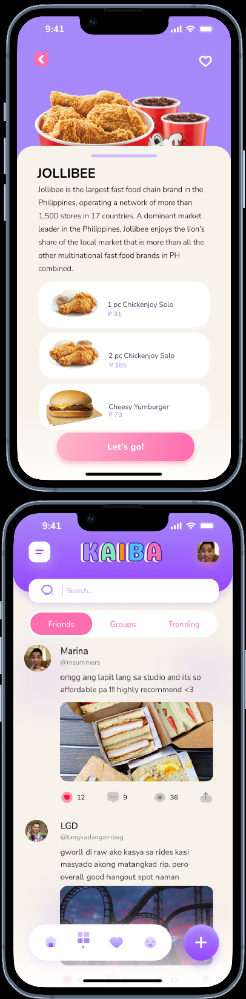

# KAIBA: Kahit Ano, Ikaw Bahala

KAIBA is a mobile application that helps users overcome indecision through interactive decision-making tools, lifestyle discovery, and social features. Inspired by the Filipino phrase *"Kahit Ano, Ikaw Bahala,"* the app turns everyday choices into a more engaging and enjoyable experience.

## Features

* **Randomizer Claw Machine** for interactive decision-making
* **Saved Locations** for discovering and keeping track of places
* **Social Media Feed** for sharing and discovering content
* **Tarot Reading** as an interactive decision-making service
* **KAIBA Merchandise** including stickers and decoden toploaders

## Tools

* Figma
* Canva

## Business Validation

KAIBA was developed using a Lean Business approach and tested through a physical bazaar, allowing the team to validate the concept through direct customer interaction and product sales.

* **30+** booth visitors
* **83** products sold
* **4** services provided
* **4** reservations

## Team

* **Adrian James Calalang**
* **Julian Oneil Morales**
* **Patricia Nicole Solomon**
* **Maria Franchesca Solomon**

## Purpose

To provide an engaging solution for people who struggle with decision-making by giving them a simple way to explore possibilities, discover new experiences, and let KAIBA decide.

## Prototype

[Figma Prototype](https://www.figma.com/proto/kR5GT9FuKNNH0wPABQ4iCV/Kaiba?type=design&node-id=70-285&t=cqIEDHpevrI0bpZ4-1&scaling=scale-down&page-id=0%3A1&starting-point-node-id=31)

## Project Showcase

